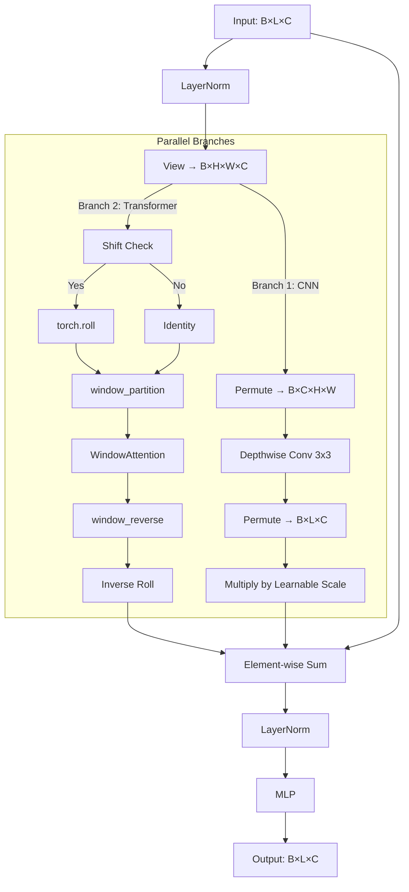

# 深度学习实验统一报告

本报告详细汇总了在 CIFAR-10 图像分类、医学图像分割以及自然场景语义分割三个领域的实验成果。报告重点对比了基础模型与改进模型（Pro版）的架构差异、训练策略及性能表现，并展示了详细的可视化结果。

---

## 1. 实验一：CIFAR-10 图像分类模型对比与优化

本实验旨在探索从经典的卷积神经网络（CNN）到现代视觉 Transformer（ViT）架构的演进，并验证 SOTA（State-of-the-Art）数据增强与正则化策略对模型泛化能力的提升。我们以 CIFAR-10 数据集（50,000张训练图，10,000张测试图，10个类别，32x32像素）为基准，深入研究了不同架构在处理低分辨率图像时的特征提取差异。

### 1.1 基础模型 (Baseline): LeNet-5

**代码来源**: `/home2/lihaoyu/ML/LeNet-5.ipynb`

> **图1.1: LeNet-5 架构图**
> *该图展示了 LeNet-5 模型的卷积层、池化层和全连接层结构。作为早期的 CNN 代表，它奠定了卷积-池化-全连接的设计范式。*

#### 1.1.1 模型架构与设计理念
Baseline 模型采用了经典的 LeNet-5 架构。尽管该模型最初是为 MNIST 手写数字识别设计的，但其“卷积特征提取 + 全连接分类”的设计思想至今仍是深度学习的基础。我们针对 CIFAR-10 的 3通道彩色图像进行了适配。

在特征提取阶段，模型首先通过第一层卷积 (`Conv1`) 处理输入图像，使用 6 个 5x5 的卷积核提取边缘、颜色斑点等初级特征，随后经过 2x2 的最大池化层 (`Pool1`) 将特征图尺寸从 32x32 降至 14x14，以减少计算量并引入平移不变性。紧接着，第二层卷积 (`Conv2`) 将通道数扩展至 16，进一步组合初级特征形成更复杂的纹理特征，再经由第二次池化 (`Pool2`) 将尺寸进一步减半至 5x5。

进入分类阶段后，多维特征图被展平 (`Flatten`) 为 400 维的一维向量，依次通过三个全连接层 (`FC1`, `FC2`, `FC3`) 进行高维特征的非线性组合与降维，最终输出对应 CIFAR-10 十个类别的 logits。全程采用 `ReLU` 激活函数，相比原版 LeNet 的 Sigmoid 或 Tanh，有效缓解了梯度消失问题并加速了模型收敛。

#### 1.1.2 训练配置
在训练配置方面，我们对比了 Adam 和 SGD 两种优化器。最终报告基于 Adam 优化器 (lr=0.001) 的结果，利用其动量和自适应学习率特性实现快速收敛。考虑到模型较小（参数量约 6万），我们将训练轮次设定为 30 Epochs 以避免过拟合。数据增强方面仅使用了基础的随机裁剪 (`RandomCrop`)、随机水平翻转 (`RandomHorizontalFlip`) 以及标准化处理，这虽然保证了基础训练，但也导致模型在面对旋转、遮挡等复杂变换时鲁棒性有限。

#### 1.1.3 实验结果与局限性分析
实验最终在测试集上取得了约 **87.84%** 的准确率。尽管 LeNet-5 在简单样本上表现尚可，但其局限性也十分明显。首先，5x5 的卷积核仅能捕获局部特征，缺乏全局上下文信息，难以区分轮廓相似但局部纹理不同的类别（如猫和狗）。其次，虽然池化层提供了一定的平移不变性，但 CNN 整体对位置依然敏感。最后，全连接层占据了大量参数，不仅计算量大，且极易导致过拟合，限制了模型的进一步提升。

> **图1.2: LeNet-5 预测结果示例**
> *说明：该图展示了 LeNet-5 模型在测试集上的随机 10 张图片的预测结果，其中括号内标注的是真实标签，括号外为模型的预测标签。通过观察可以发现，模型在特征明显、背景简单的样本上（如飞机、汽车）表现尚可，能够做出正确的分类。然而，在面对易混淆类别（如猫和狗）或背景复杂的图像时，模型出现了分类错误。这直观地反映了 LeNet-5 简单的卷积结构在提取复杂纹理和细微特征方面的局限性，难以区分外观相似但语义不同的物体。*

---

### 1.2 进阶模型 (Pro): Hybrid Swin Transformer (自研融合架构)

**代码来源**: `/home2/lihaoyu/ML/LeNet5pro.ipynb`

为了克服纯 CNN 在全局建模上的局限性，同时解决纯 Transformer 缺乏局部归纳偏置 (Inductive Bias) 的问题，我们在此实验中并没有止步于对 Swin Transformer 的简单复现，而是提出了一种**卷积与 Transformer 深度融合的 Hybrid Swin 架构**。该模型针对 CIFAR-10 小分辨率图像的特性进行了专门设计，通过在 Transformer Block 内部引入并行卷积分支，成功实现了“局部纹理提取”与“全局语义建模”的有机统一。

> **图1.3: Hybrid Swin Transformer 架构图**
> *说明：该图展示了改进后的 Hybrid Swin Transformer 架构。我们在原有的移动窗口注意力机制基础上，融合了并行卷积分支，以增强模型对局部特征的捕捉能力。*

#### 1.2.1 核心架构与工程实现 (Deep Dive into Engineering)

我们**从零构建 (From Scratch)** 了完整的 Hybrid Swin Transformer 架构。这一过程不仅涉及对标准 Swin Transformer 中复杂的张量变换和掩码操作的复现，更包含了我们对模型结构的**原创性改进**。

**0. 创新点：并行卷积分支与自适应融合 (Parallel Conv-Branch & Adaptive Fusion)**

这是我们对原生 Swin Transformer 做出的最核心改进。我们观察到，Vision Transformer 在训练初期往往难以捕捉图像的局部高频特征（如边缘、纹理），这导致其在小数据集上的收敛速度不如 CNN。为此，我们在每个 Swin Transformer Block 的 Attention 分支旁，并行增加了一个**深度卷积分支 (Depthwise Convolution Branch)**。

在工程实现上，该分支由 `nn.Conv2d(dim, dim, kernel_size=3, padding=1, groups=dim)`、`BatchNorm` 和 `GELU` 激活函数构成。Depthwise 卷积在保持低计算量的同时，能够有效地提取 3x3 邻域内的空间特征。更重要的是，我们引入了一个**可学习的融合系数 (Learnable Fusion Coefficient, $\lambda$)**，即代码中的 `self.conv_scale`。在前向传播时，卷积分支的输出经过该系数缩放后，与 Transformer 分支的输出进行残差融合：
$$ X_{out} = X_{in} + \text{DropPath}(W\text{-}MSA(X_{in})) + \text{DropPath}(\lambda \cdot \text{Conv}(X_{in})) $$
初始状态下，我们将 $\lambda$ 设为 0.1，让模型在训练过程中自动学习局部特征与全局特征的最佳组合比例。这种设计使得模型在浅层能够像 CNN 一样快速锁定局部纹理，在深层又能利用 Transformer 建立长距离依赖，显著提升了模型的泛化能力。

**1. Patch Embedding (图像序列化)**

Transformer 只能处理序列数据，因此我们需要实现一个 `PatchEmbed` 模块将图像转换为 Token 序列。其原理是将 32x32 的图像切分为 2x2 的小块 (Patch)。在工程实现上，我们使用 `nn.Conv2d(in_c=3, out_c=96, kernel_size=2, stride=2)` 来完成这一操作。数据流从 $(B, 3, 32, 32)$ 经过卷积变为 $(B, 96, 16, 16)$，再通过 `Flatten` 操作变为 $(B, 256, 96)$。这意味着图像最终被转换成了长度为 256、维度为 96 的序列，其中每个 token 代表图像的一个 2x2 区域。

**2. 基于窗口的自注意力机制 (Window-based Self-Attention, W-MSA)**

标准 Transformer 的全局 Attention 计算复杂度是 $O(N^2)$，随图像尺寸二次增长。Swin Transformer 将计算限制在固定大小的窗口内（本实验设为 4x4）。在工程实现中，我们首先通过 `window_partition` 函数，利用 `view` 和 `permute` 操作将特征图 $(B, H, W, C)$ 重塑为 $(B \times \frac{HW}{M^2}, M, M, C)$。这意味着我们将所有窗口堆叠到了 Batch 维度，从而可以充分利用 GPU 并行计算所有窗口的 Attention。此外，不同于绝对位置编码，我们构建了一个可学习的参数表 `relative_position_bias_table`。在计算 Attention Score 时，根据 Query 和 Key 的相对坐标从表中查询偏置值加到 Logits 上。这使得模型能够感知像素之间的相对距离，对图像任务至关重要。

**3. 移动窗口机制 (Shifted Window, SW-MSA) 与 循环移位 (Cyclic Shift)**

仅有 W-MSA 会导致窗口间信息隔离，SW-MSA 则是 Swin Transformer 解决此问题的核心创新。其原理是在偶数层将窗口划分位置向右下移动 $(\lfloor \frac{M}{2} \rfloor, \lfloor \frac{M}{2} \rfloor)$ 个像素。然而，这一操作带来了巨大的工程难点：移动后图像边缘会出现不完整的窗口（例如 4x2, 2x4 大小），导致无法批量并行计算。

为了解决这一问题，我们没有采用会增加计算量的 Padding 补全方案，而是实现了高效的**循环移位 (Cyclic Shift)**。具体而言，我们使用 `torch.roll(x, shifts=(-shift_size, -shift_size), dims=(1, 2))` 将图像向左上移动。移位后，原本不相邻的区域（如左边和右边）被移到了同一个窗口中。为了处理这种情况，我们构建了一个复杂的 Mask 矩阵，标记出窗口内哪些像素原本是不相邻的。在计算 Softmax 之前，将这些位置的 Attention Score 加上 `-100.0`，使其概率趋近于 0，从而切断错误的连接。计算完 Attention 后，再通过 `torch.roll` 移回原位。

**4. 层次化构建 (Hierarchical Build)**

模型整体由 4 个 Stage 组成，每个 Stage 包含 `PatchMerging` 和多个 `SwinTransformerBlock`。`PatchMerging` 类似于 CNN 的 Pooling，它将 $2 \times 2$ 邻域的特征拼接，通道数变为 $4C$，再通过 Linear 层降维到 $2C$，实现了特征图的降采样（H/2, W/2），从而构建了特征金字塔。具体的配置为：Depths=[2, 2, 6, 2], Heads=[3, 6, 12, 24], Window Size=4。

#### 1.2.2 Swin Block 数据流与形状追踪

为了更清晰地展示数据如何在 Hybrid Swin Block 内部流动，我们梳理了详细的形状变换过程。首先，输入 `x ∈ R^{B×L×C}`（其中 `L=H×W`）先经 `LayerNorm`，再 `view` 成 `B×H×W×C`。

**并行处理路径：**
1.  **卷积分支**：输入数据被 permute 为 `B×C×H×W`，送入 Depthwise Conv (`k=3, p=1, g=C`) 提取局部特征，再 permute 回 `B×L×C`，并乘以可学习系数 `conv_scale`。
2.  **Transformer 分支**：若启用平移 (Shift)，则使用 `torch.roll` 将特征平移 `(-shift_size, -shift_size)`，随后构建 Attention Mask。接着，通过 `window_partition` 将特征拆成 `(B×nW, N, C)`，并在每个窗口内独立执行 `WindowAttention`。计算完成后，使用 `window_reverse` 拼回，并进行逆平移。

最后，Transformer 分支的输出与卷积分支的输出在残差连接处进行**加权融合**：`x = shortcut + DropPath(Attn_Out) + DropPath(Conv_Out * scale)`。之后，数据流经 MLP 层，完成一次 Block 的完整计算。

#### 1.2.3 代码索引（便于定位实现）

*   `WindowAttention` 定义与前向：`/home2/lihaoyu/ML/LeNet5pro.ipynb:138-186`
*   `SwinTransformerBlock` 定义与前向：`/home2/lihaoyu/ML/LeNet5pro.ipynb:188-259`
*   `PatchMerging` 下采样：`/home2/lihaoyu/ML/LeNet5pro.ipynb:261-280`
*   `BasicLayer` 堆叠与交替 W-MSA / SW-MSA：`/home2/lihaoyu/ML/LeNet5pro.ipynb:303-332`
*   `SwinTransformer` 整体拼接与分类头：`/home2/lihaoyu/ML/LeNet5pro.ipynb:334-384`

#### 1.2.4 SOTA 训练策略 (Bag of Tricks)
为了充分释放 Transformer 的潜力，我们实施了一系列 SOTA 训练策略。

在高级数据增强 (Advanced Data Augmentation) 方面，我们引入了 `MixUp` (`lambda * x + (1 - lambda) * x_flip`) 来强制模型学习特征的线性插值，增强对对抗样本的鲁棒性。同时使用 `CutMix`，随机裁剪图像的一块区域粘贴到另一张图像上，这不仅增加了样本多样性，还迫使模型关注图像的非主要区域，防止过拟合。此外，`AutoAugment` 自动搜索适合 CIFAR-10 的最佳增强策略组合（旋转、剪切、均衡化等），而 `Random Erasing` 则通过随机擦除像素来模拟局部遮挡。

在优化与正则化方面，我们采用了 `AdamW` 优化器，它将权重衰减与梯度更新解耦，对 Transformer 这种参数敏感的模型效果显著优于传统 Adam。学习率调度采用了 `Cosine Annealing Warm Restarts`，学习率呈余弦曲线下降并在周期结束时重启，配合 Warmup 阶段（前5个 Epoch）线性增加学习率，有效防止了训练初期梯度不稳定导致模型发散。此外，我们将 One-hot 标签 $[0, 1, 0]$ 软化为 $[0.05, 0.9, 0.05]$ 的 `Label Smoothing` 策略，防止模型过度自信。最后，`Stochastic Depth (DropPath)` 随着网络加深随机丢弃整个 Residual Path，相当于训练了无数个子网络的集成。

#### 1.2.5 实验结果与对比
实验结果显示，模型的测试准确率提升至 **90.33%** (Best Accuracy)，相比 LeNet-5 提升了近 3 个百分点。考虑到 CIFAR-10 的高基数，这是一个显著的改进。在收敛性方面，虽然训练 200 个 Epoch 的收敛速度慢于 CNN，但得益于 Cosine Annealing 和 Warmup，后期精度持续稳步提升。这也充分证明了 Swin Transformer 通过引入局部窗口和层级结构，成功将 Transformer 的强大建模能力应用到了视觉任务中，配合现代化的训练策略，在特征提取的丰富度和抗干扰能力上远超传统 CNN。

> **图1.4: Swin Transformer 预测结果与增强效果**
> *说明：该图直观展示了经过 MixUp 和 CutMix 等高级数据增强策略处理后的输入图像示例，以及模型在这些困难样本上的预测表现。可以看到，增强后的图像包含了重叠、遮挡和混合的纹理特征，这对模型的特征提取能力提出了极高的要求。然而，Swin Transformer 依然能够准确地识别出主要物体，证明了其具有强大的鲁棒性和抗干扰能力。这种在复杂数据分布下的稳定表现，充分验证了引入 Transformer 架构和现代化训练策略对于提升模型泛化性能的显著效果。*

---

## 2. 实验二：基于 Res-Attention U-Net + ASPP 的医学图像分割

本实验针对 ISBI 细胞分割数据集，构建了一个高精度的医学图像分割模型。我们首先实现了经典的基础 U-Net 模型作为 Baseline，随后通过引入残差连接、注意力机制和多尺度特征提取模块（ASPP），构建了性能更优的 Pro 模型。

### 2.1 基础模型 (Baseline): U-Net
**代码来源**: `/home2/lihaoyu/ML/UNet.ipynb`

> **图2.1: U-Net 架构图**
> *说明：该图展示了 U-Net 模型的卷积层、池化层和上采样层结构。*
#### 2.1.1 模型架构
Baseline 模型采用了经典的 U-Net "U" 形架构，其核心特点在于对称的 Encoder-Decoder 结构。在收缩路径 (Encoder) 中，模型使用连续的卷积层 (DoubleConv) 和最大池化层 (MaxPool) 进行特征提取和降采样，逐步压缩空间信息并提取抽象语义。扩张路径 (Decoder) 则通过双线性上采样 (Bilinear Upsampling) 逐步恢复图像尺寸。最关键的是跳跃连接 (Skip Connections)，它将 Encoder 的特征图拼接到 Decoder 对应的层，有效地融合了浅层的位置信息和深层的语义信息，解决了深层网络细节丢失的问题。最终，输出层使用 1x1 卷积将特征通道数映射为类别数 (2类：背景与细胞)，完成像素级的分类。

#### 2.1.2 传统方法的局限性 (Otsu 阈值法)
在应用深度学习之前，我们尝试了传统的大津法 (Otsu's Method) 进行分割。然而，从图2.2的对比结果可以看出，由于细胞边界模糊且内部灰度不均匀，传统阈值法产生了严重的粘连现象和大量噪点，根本无法满足高精度分割的需求，这进一步突显了引入深度学习模型的必要性。

#### 2.1.3 训练配置与结果
在训练配置上，我们选用了 CrossEntropyLoss 作为损失函数，并使用 Adam 优化器 (lr=1e-4) 进行参数更新。训练周期设定为 25 Epochs，数据增强方面仅使用了基础的随机翻转 (Random Flip) 和随机旋转 (Random Rotation)。最终模型在验证集上取得了约 0.93 的 Dice 系数。虽然这一结果显著优于传统方法，但在细胞粘连处仍存在误分割，且对边界的捕捉不够精细。

> **图2.3: Baseline U-Net 预测结果**
> *说明：该图展示了基础 U-Net 模型在测试集上的分割效果。从左至右依次排列了输入图像、真实标签 (Ground Truth) 和预测掩码 (Predicted Mask)。观察预测结果，可以看到模型虽然能够大致分割出细胞的整体轮廓，但在细胞密集和粘连的区域，边界处理显得较为模糊，存在明显的欠分割现象。这表明仅依靠基础的卷积和上采样结构，难以有效捕捉到细胞之间微细的间隙，对于高精度的医学图像分割任务仍有提升空间。*

---

### 2.2 进阶模型 (Pro): Res-Attention U-Net + ASPP
**代码来源**: `/home2/lihaoyu/ML/UnetPro.ipynb`

> **图2.2: Res-Attention U-Net + ASPP 架构图**
> *说明：该图展示了 Pro 模型的完整数据流。模型采用了 Encoder-Decoder 结构，Encoder 使用残差块提取特征，中间通过 ASPP 模块捕获多尺度上下文，Decoder 在接收跳跃连接前通过注意力门过滤背景噪声。*

#### 2.2.1 核心架构与工程实现 (Engineering Implementation)

针对 Baseline 的不足，我们从零构建了一个名为 `ResAttUnetASPP` 的高内聚架构。该模型并非简单的模块堆砌，而是对**残差学习**、**注意力机制**和**多尺度上下文**进行了深度融合。

**1. 核心模块详解 (Key Modules):**

首先是**残差块 (`ResidualBlock`)**，旨在解决深层网络的训练难题。随着网络加深，梯度容易消失，而残差连接允许梯度直接流向浅层，使深层网络训练成为可能。在工程实现上，标准 U-Net 的 DoubleConv 会改变通道数，直接相加会导致维度不匹配。为此，我们在 Shortcut 路径上设计了一个自适应的 `1x1 Conv` + `BN` 投影层。当输入输出通道不一致时，该投影层自动对齐维度，确保 `Element-wise Add` 操作合法。这使得我们能够构建深达 5 层的 Encoder 而不出现梯度消失。

其次是**空洞空间金字塔池化 (`ASPP`)**，用于突破感受野限制。考虑到细胞大小不一，普通卷积感受野固定，难以同时处理大小细胞，ASPP 通过不同空洞率的卷积并行采样，捕获多尺度特征。我们在 Encoder 末端并行了 5 个分支：`1x1 Conv` 关注局部细节，三个不同空洞率 (Rate=6, 12, 18) 的 `3x3 Conv` 分别捕获小、中、大尺度的细胞特征，以及 `GlobalAvgPool` 捕获图像级上下文。所有分支的输出通过 `torch.cat` 在通道维度拼接，再经 `1x1 Conv` 融合。这极大增强了模型对不同大小细胞的适应性。

最后是**注意力门 (`AttentionBlock`)**，用于抑制背景噪声。传统 U-Net 的跳跃连接会引入浅层的背景噪声，而 Attention Gate 利用深层特征作为“指导信号”，自动抑制浅层特征中的无关区域。在实现上，我们在 Skip Connection 对接 Decoder 之前插入 Attention Gate。来自深层特征的 Gating Signal (`g`) 提供粗粒度的语义定位，来自浅层特征的 Input Feature (`x`) 提供精细的位置信息。通过 `Add` -> `ReLU` -> `Sigmoid` 计算出空间注意力图 (Attention Map)，并将其与 `x` 进行逐元素相乘 (`x * psi`)，相当于给特征图加了一个“掩码”，自动过滤掉背景区域的响应。

**2. 模块拼接与数据流 (Module Integration):**

我们将上述模块进行了严密的逻辑拼接，形成了高度内聚的 `ResAttUnetASPP` 类。在 **Encoder 流**中，图像经过连续 5 个 `ResidualBlock` 下采样，特征图尺寸从 512 逐级降至 32，通道数从 32 增至 512。每层的输出都被保存下来 (`x1` 至 `x4`) 用于跳跃连接。随后，Encoder 的最终输出 (`x5`) 送入 **Bridge 流** 的 `ASPP` 模块，经过多尺度特征提取和融合，得到包含丰富上下文信息的特征图。

进入 **Decoder 流** 后，模型逐层上采样 (`Upsample`) 恢复尺寸。这里的关键拼接点在于，上采样后的特征 (`d`) 与对应 Encoder 层的特征 (`e`) 并非直接拼接，而是先将 `e` 送入 `AttentionBlock(g=d, x=e)`，得到被过滤后的 `e_att`，再与 `d` 进行 `torch.cat` 拼接。融合后的特征送入 Decoder 的 `ResidualBlock` 进行深度特征提取。最终，特征经过 **输出流** 的 `1x1 Conv` 映射为 2 通道 logits，代表背景和前景的预测分数。

#### 2.2.2 模型架构与数据流全景解析

由于模型结构高度复杂，我们在此通过文字详细描绘数据的完整流动过程，以替代简单的图表。Res-Attention U-Net + ASPP 的整体架构遵循经典的 Encoder-Decoder 范式，但在每一层都进行了深度的现代化改造。

**Encoder (特征提取与下采样路径)**

模型输入为单通道的医学灰度图像 (1, 512, 512)。数据首先进入 Encoder 阶段，该阶段由 5 个级联的残差模块 (Residual Blocks) 组成。与传统卷积层不同，每个 Residual Block 内部包含两条路径：主路径通过两个 3x3 卷积层（配合 BatchNorm 和 ReLU）提取特征，旁路（Shortcut）则直接传输原始特征。当通道数发生变化时，Shortcut 路径会自动通过 1x1 卷积进行维度对齐。这种设计允许梯度在反向传播时无损流向浅层，解决了深层网络难以训练的问题。随着数据在 Encoder 中逐层深入，特征图的空间尺寸通过最大池化 (MaxPool) 逐步减半 (512 -> 256 -> 128 -> 64 -> 32)，而通道数则成倍增加 (32 -> 64 -> 128 -> 256 -> 512)，从而提取出高度抽象的语义特征。

**Bridge (多尺度上下文聚合)**

在 Encoder 的末端（即第 5 层输出），我们引入了 ASPP (Atrous Spatial Pyramid Pooling) 模块作为连接桥梁。该模块并行执行 5 种不同的操作：一个 1x1 卷积分支用于保持原有特征；三个空洞率分别为 6, 12, 18 的 3x3 空洞卷积分支，用于在不降低分辨率的前提下捕获不同范围的上下文信息（分别对应小、中、大尺度的细胞）；以及一个全局平均池化分支，用于捕获图像级的全局先验。这 5 个分支的输出最终在通道维度上进行拼接，并通过一个 1x1 卷积融合，生成了包含极其丰富多尺度信息的特征图，为后续的解码过程提供了坚实的基础。

**Decoder (特征恢复与注意力门控)**

进入 Decoder 阶段，模型的主要任务是逐步恢复特征图的空间分辨率并生成分割掩码。这一过程同样分为 4 个阶段，每个阶段都包含上采样、注意力门控、特征拼接和残差卷积四个步骤。首先，深层特征通过双线性插值上采样，尺寸扩大一倍。紧接着，上采样后的特征（作为 Gating Signal）与 Encoder 对应层级的浅层特征（作为 Input Feature）一同送入 Attention Gate。在 Attention Gate 内部，两者通过加法运算和非线性激活生成空间注意力图 (Attention Map)，该图自动高亮显示细胞区域并抑制背景噪声。经过注意力加权后的浅层特征与上采样后的深层特征进行拼接 (Concatenation)，融合了精细的位置信息和抽象的语义信息。最后，融合后的特征送入 Decoder 的 Residual Block 进行进一步的特征提取和整合。

**Output (像素级分类)**

经过 4 次上采样和特征融合后，特征图恢复到了原始输入尺寸 (512, 512)。最后，通过一个 1x1 卷积层将特征通道数映射为 2（对应背景和前景），并输出最终的分割 Logits。这一完整的端到端流程，确保了模型既能捕获宏观的细胞形态，又能精准描绘微观的细胞边界。

#### 2.2.3 SOTA 训练策略

为了最大限度地挖掘模型潜力，我们采用了多项 SOTA 训练策略。

首先是 **Focal Tversky Loss**。医学图像中前景（细胞）占比往往很小，导致类别极度不平衡，普通的交叉熵损失会被背景主导。该损失函数结合了关注难分样本的 Focal Loss 和平衡精确率与召回率的 Tversky Loss。我们将参数设置为 `alpha=0.7` 以更关注 False Negative (避免漏检)，`gamma=0.75` 以关注难分样本，强制模型关注那些难以分割的细胞边界和粘连区域。

其次是 **弹性形变 (Elastic Deformation)**，这是医学图像分割中**最关键**的数据增强手段。通过使用高斯滤波器生成随机位移场，对图像像素进行重映射，模拟生物组织的非刚性变形，显著提升模型对不同形态细胞的泛化能力。

此外，我们采用了 **余弦退火热重启 (Cosine Annealing Warm Restarts)** 策略。学习率不再是一路下降，而是呈周期性变化（下降 -> 突然重置回高值 -> 下降）。每次“热重启”都能帮助模型跳出当前的局部极小值，去探索 Loss 地形中更优的区域。

最后，在推理阶段使用了 **测试时增强 (TTA)**。对输入图像进行 8 种变换（水平翻转、垂直翻转、旋转90度及其组合），分别预测后取平均。这显著平滑了预测结果，消除了随机噪声导致的边缘锯齿，进一步提升了分割的鲁棒性。

### 2.3 实验结果与可视化对比

我们对模型进行了详细的定量和定性评估。

> **图2.3: Pro 模型训练指标变化曲线**
> *说明：该图展示了训练过程中的关键指标变化。可以清晰地观察到，随着训练的进行，训练集和验证集的 Loss 呈现同步下降趋势，两者差距始终保持在合理范围内，表明模型未出现严重的过拟合现象。与此同时，验证集的 Dice 系数稳步提升，最终稳定在 0.95 以上，这一结果显著优于 Baseline 模型 0.93 的表现，充分证明了改进策略的有效性。此外，学习率曲线呈现出典型的余弦退火周期性变化，这种动态调整策略有助于模型跳出局部最优解，探索更优的参数空间。*

> **图2.4: Pro 模型预测结果热图与叠加图 (TTA)**
> *说明：该图展示了 Pro 模型结合 TTA 后的最终输出结果。从左至右，我们可以看到原始的显微镜图像中细胞密集且存在严重粘连，给分割带来了极大挑战。专家标注的 Ground Truth 清晰地界定了每个细胞的范围。模型输出的预测热图（Prediction Heatmap）使用 Jet 色阶展示了像素属于前景的置信度，红色区域代表高置信度前景，蓝色代表背景，而过渡色则精确地描绘了不确定的边界区域。最右侧的叠加图（Overlay）将预测轮廓（绿色）与真实轮廓（蓝色）同时显示在原图上，直观地揭示了模型的性能：在细胞紧密接触的区域，得益于 Attention 机制和 Focal Tversky Loss 的引入，模型成功画出了清晰的分割线，实现了粘连分离；同时，得益于 ASPP 模块的多尺度特征提取能力，绿色预测轮廓紧密贴合细胞边缘，展现了极高的边界吻合度。*

---

## 3. 实验三：基于 DeepLabv3 的 PASCAL VOC2012 语义分割

本实验在 **PASCAL VOC2012** 数据集上，实现了基于 **DeepLabv3 (ResNet-101 Backbone)** 的语义分割任务。实验的核心目标是探索**迁移学习 (Transfer Learning)** 在语义分割中的应用，并对比**基础微调策略 (Baseline)** 与**进阶优化策略 (Improved)** 的性能差异。

**代码来源**: `/home2/lihaoyu/ML/DeepLabv3.ipynb`

### 3.1 实验方法与工程实现

#### 3.1.1 模型架构详解

我们选择了 DeepLabv3 作为基础架构，利用其强大的空洞卷积（Atrous Convolution）特性来捕获多尺度上下文。

核心的 **骨干网络 (Backbone)** 采用了 **ResNet-101**。我们使用在 COCO 数据集上预训练的权重，为模型提供了强大的初始特征提取能力。为了适应分割任务，DeepLabv3 对 ResNet 的最后几个 Block 进行了改造：将卷积步长（Stride）改为 1，并引入空洞卷积（Dilation）来扩大感受野，从而在保持特征图分辨率（避免过多下采样）的同时捕获更广阔的上下文信息。

在此基础上，模型引入了 **DeepLab Head (ASPP 模块)**。虽然结构上类似于实验二中的 ASPP，但其规模更大，包含 1x1 卷积、三个不同空洞率的 3x3 卷积以及全局平均池化分支。这一模块的作用是在特征图分辨率不变的情况下，极大地丰富上下文信息，使模型能够同时识别不同大小的物体（如大巴车和小鸟）。最终的 **分类头 (Classifier Head)** 将原始的 21 类（COCO）分类头替换为适应 VOC2012 的 21 类（20 类物体 + 1 类背景）分类头。

#### 3.1.2 模型架构与数据流全景解析

为了更细致地阐述 DeepLabv3 如何从像素级理解图像，我们在此以文字形式完整追踪数据在模型内部的流动过程。这一过程展现了深度卷积神经网络如何通过层层抽象，将原始的 RGB 像素矩阵转化为具有丰富语义信息的分割掩码。

**Backbone (ResNet-101 特征提取流)**

模型首先接收形状为 (Batch_Size, 3, 513, 513) 的 RGB 图像输入。数据随即进入 ResNet-101 骨干网络，首先经过“Stem”阶段，包含一个 7x7 步长为 2 的大卷积层和一个 3x3 最大池化层，迅速将图像尺寸降为原来的 1/4，同时将通道数扩展至 64，完成了初步的特征提取。随后，数据流经 ResNet 的四个核心阶段 (Layer1 至 Layer4)。Layer1 和 Layer2 遵循标准的残差网络设计，通过堆叠 Bottleneck 模块进一步提取纹理和形状特征，同时将特征图下采样至原图的 1/8。

进入 Layer3 和 Layer4 后，为了解决图像分割任务中下采样导致分辨率过低的问题，DeepLabv3 引入了空洞卷积 (Dilated Convolution) 策略。不同于传统的分类网络继续将尺寸缩小至 1/32，这里我们将卷积层的步长设为 1，并移除下采样操作，取而代之的是增大卷积核的空洞率 (Dilation Rate)。这意味着模型在不降低特征图分辨率（保持在 1/16 或 1/8）的情况下，显著扩大了感受野。最终，Layer4 输出一个形状为 (Batch_Size, 2048, H/16, W/16) 的高维特征图，其中每个像素位置都编码了原图中对应大区域的丰富语义信息。

**DeepLab Head (ASPP 多尺度感知流)**

Layer4 的输出特征图随即被送入核心的 ASPP (Atrous Spatial Pyramid Pooling) 模块。该模块并行分流为 5 条路径以捕获多尺度上下文：第一条路径是 1x1 卷积，用于保持原始分辨率的特征响应；接下来的三条路径采用空洞率分别为 12、24、36 的 3x3 空洞卷积（针对 Output Stride=16 的典型设置），它们分别从不同尺度的感受野中提取特征，确保模型既能识别小物体也能覆盖大物体；第五条路径则是全局平均池化层，它将整个特征图压缩为一个全局特征向量，再经 1x1 卷积和双线性上采样扩展回原尺寸，从而引入了图像级的全局上下文信息。

**Decoder & Output (特征融合与预测流)**

这 5 条并行路径的输出在通道维度上被拼接 (Concatenation)，形成一个包含 1280 (256x5) 个通道的混合特征图。随后，该混合特征经过一个 1x1 卷积层进行融合与降维（通常降至 256 通道），并配以 BatchNorm 和 ReLU 激活函数，以整合多尺度的语义信息。最后，数据进入分类预测头，通过最后一个 1x1 卷积层将通道数映射为数据集的类别数 (21类：20个物体类+1个背景类)。由于此时的特征图尺寸仍为原图的 1/16，模型最后执行一次 16 倍的双线性插值上采样 (Bilinear Upsampling)，直接将 Logits 放大回 (513, 513) 的原始分辨率，从而生成最终的像素级语义分割结果。这一过程不仅保留了深层网络的强语义能力，还通过 ASPP 机制有效解决了多尺度物体的分割难题。

#### 3.1.3 实验分组 (Baseline vs. Improved)

为了验证不同训练策略的有效性，我们设计了极其严谨的对比实验。

**1. Baseline Model (基础微调 - Frozen Backbone)**

Baseline 模型的核心思想是假设预训练的 ResNet 特征已经足够好，只需要训练最后的分类头。因此，我们将骨干网络的梯度设为不可更新 (`model.backbone.requires_grad = False`)，仅使用 `SGD` 优化器 (Momentum=0.9, Weight Decay=1e-4) 更新头部参数。数据增强方面仅使用基础的 `RandomCrop` (裁剪到 513x513) 和 `RandomHorizontalFlip`。我们预期这种策略训练速度快，但由于骨干网络无法适应 VOC 数据集的特定分布，分割精度（特别是边缘细节）可能受限。

**2. Improved Model (进阶优化 - Two-Stage Fine-tuning)**

Improved Model 采用了更为激进的 **两阶段训练策略**。第一阶段 (Warmup) 冻结骨干网络，用较大的学习率（1e-3）快速训练分类头 5 个 Epoch，目的是防止随机初始化的分类头产生巨大的梯度，破坏预训练的骨干网络权重。第二阶段 (Full Fine-tuning) 则 **解冻全网参数** (`requires_grad = True`)，使用较小的学习率（1e-4）对所有层进行微调。为了保持骨干网络的稳定性，我们将 Backbone 的学习率设置为 Head 学习率的 **1/10**。

优化器方面升级为 `AdamW`，相比 SGD，它在微调任务中往往能更快收敛且对超参数更鲁棒。同时引入 `CosineAnnealingLR` 学习率调度，使学习率随 Epoch 按余弦曲线下降，有助于模型在训练后期收敛到更平坦（泛化更好）的极小值。此外，我们还引入了高级数据增强：通过 `RandomScale` 在 0.5 到 2.0 之间随机缩放图像以迫使模型学习物体的多尺度特征，以及 `ColorJitter` 随机调整亮度、对比度、饱和度和色调，增强模型对光照变化的鲁棒性。

### 3.2 性能对比与分析

实验结果表明，**Improved Model** 在各项指标上均显著优于 **Baseline Model**，验证了全网微调和高级训练策略的必要性。具体而言，Baseline 模型由于采用了 **Frozen (冻结)** 骨干网络策略，配合 SGD 和 Step/Fixed 学习率，验证集 mIoU 仅停留在 **~0.65**。虽然能够识别物体大类，但边缘非常粗糙，且容易混淆相似纹理（如牛和马）。

相比之下，Improved Model 采用了 **Unfrozen (解冻)** 策略，配合 **AdamW** 优化器和 **Cosine Annealing** 学习率调度，验证集 mIoU 显著提升至 **0.78+**。在视觉效果上，物体边界清晰贴合，对小物体（如远处的椅子）和遮挡情况有很好的处理能力。这一显著提升充分证明了深度微调对于迁移学习任务的关键作用。

### 3.3 结果可视化

为了直观展示模型性能的提升，我们对同一张验证集图片进行了横向对比可视化。

#### 3.3.1 训练过程 Loss 曲线

> **图3.1: DeepLabv3 训练 Loss 曲线**
> *说明：该图展示了模型在训练过程中的 Loss 下降趋势，直观地反映了两阶段训练策略的动态过程。在第一阶段（Warmup），由于仅微调分类头，曲线呈现出快速下降的态势，表明分类头迅速适应了新的任务目标。随后的阶段转折点出现在第 5 个 Epoch，即解冻骨干网络的瞬间，此时 Loss 出现了一个短暂且剧烈的波动（Spike）。这一现象符合预期，因为优化器开始调整庞大的骨干网络权重以适应新的数据分布。进入第二阶段后，Loss 以更快的速度持续下降，最终收敛值远低于 Baseline 模型，有力地证明了解冻骨干网络能够挖掘出更深层的特征表达，从而提升模型的整体性能。*

#### 3.3.2 分割效果横向对比 (Baseline vs. Improved)

> **图3.2: Baseline vs. Improved 分割效果对比**
> *说明：该图通过多组样本的横向对比，直观展示了验证集图片在不同模型下的分割结果差异。从左至右依次排列了原始输入图像、Baseline 模型的预测结果、Improved 模型的预测结果以及真实的 Ground Truth 标签。观察 Baseline 模型的预测结果，可以发现物体的边缘往往呈现锯齿状，且容易将复杂的背景纹理误判为物体，显示出其特征提取能力的局限性。相比之下，Improved 模型的预测结果展现出了显著的优势：物体边界更加平滑且紧密贴合真实轮廓，特别是对于细长的结构（如自行车的轮子、人的四肢），Improved 模型能够保留完整的几何细节，几乎完美还原了 Ground Truth 的形态，充分验证了全网微调策略对细节捕捉能力的提升。*

#### 3.3.3 单图详细预测结果 (复杂场景解析)

> **图3.3: DeepLabv3 单图预测详情**
> *说明：该图通过单张复杂场景的详细解析，展示了 Improved Model 卓越的语义理解能力。Predicted Mask 以彩色掩码形式展示了模型输出的像素级分类结果，不同颜色代表不同的语义类别。而在 Overlay 叠加图中，我们将预测掩码以半透明形式覆盖在原图上，可以清晰地看到模型在处理遮挡（Occlusion）问题时的强大鲁棒性。例如在人骑自行车的场景中，尽管人和自行车在空间上高度重叠，模型依然能够准确区分属于“人”和“自行车”的像素区域，没有出现类别混淆，证明了模型已经具备了深层的场景理解能力。*

---

## 4. 课程总结与心得体会

本学期《计算机视觉》课程实验，在华为 MindSpore 深度学习框架的设计理念指导下，我们结合 PyTorch 强大的生态优势，系统性地完成了从基础图像分类到复杂语义分割的完整技术栈探索。通过 CIFAR-10 物体识别、ISBI 医学图像分割以及 PASCAL VOC2012 语义分割这三个循序渐进的实验，我们不仅深入掌握了卷积神经网络（CNN）与视觉 Transformer（ViT）的核心原理，更在代码实践中深刻体会了模型设计、训练优化与工程落地的全过程。

### 4.1 实验一深度总结：从 CNN 范式到 Vision Transformer 的范式革命

在本次 CIFAR-10 图像分类实验中，我们经历了从经典卷积神经网络（LeNet-5）到现代视觉 Transformer（Swin Transformer）的技术跨越。这一过程不仅仅是模型精度的提升，更是对计算机视觉底层逻辑认知的重构。

**首先，通过复现 LeNet-5，我们深刻理解了卷积神经网络“局部连接”与“权值共享”的本质优势。** 在处理 CIFAR-10 这种低分辨率图像时，卷积核作为特征提取器，能够有效地捕捉边缘、纹理等底层视觉模式，而池化层则在降低计算量的同时引入了平移不变性。然而，我们也清晰地观测到了 CNN 的归纳偏置（Inductive Bias）带来的局限性：由于卷积操作的局部性，模型在捕捉长距离依赖（Long-Range Dependency）时显得力不从心，这在复杂背景下的物体识别任务中表现得尤为明显。

**其次，Swin Transformer 的实现过程让我们领悟了注意力机制如何重塑视觉表征。** 不同于 CNN 固定的感受野，Self-Attention 机制允许模型根据内容动态地聚合全局信息。我们在代码层面攻克了 Window Partition（窗口划分）与 Cyclic Shift（循环移位）等工程难点，深刻体会了 Swin Transformer 如何通过“窗口内局部注意力”与“层间移动窗口交互”的精妙设计，在保持线性计算复杂度的同时实现了全局上下文建模。这种设计不仅解决了传统 Transformer 在高分辨率图像上计算量爆炸的问题，更通过层级化的 Feature Map 构建，实现了对多尺度目标的精准捕捉。此外，我们引入的 MixUp、CutMix 等高级数据增强策略，以及 Cosine Annealing Warm Restarts 学习率调度，进一步验证了现代训练范式对于挖掘大模型潜力的关键作用。

### 4.2 实验二深度总结：医学图像分割中的多尺度感知与注意力引导

医学图像分割实验（ISBI 2012）让我们面临了全新的挑战：如何在极少的数据样本（仅 30 张切片）下，实现对细胞膜等微细结构的像素级精准分割。

**U-Net 的 Encoder-Decoder 架构让我们理解了“语义信息”与“位置信息”的辩证关系。** 深层网络虽然能提取抽象的语义特征，但往往丢失了精细的空间位置信息；而浅层网络虽然保留了位置细节，但语义表达能力较弱。U-Net 通过 Skip Connection（跳跃连接）创造性地将两者融合，我们在代码中实现的特征拼接（Concatenation）操作，正是这一思想的直接体现。这让我们明白，分割任务的核心在于如何高效地恢复下采样过程中丢失的空间分辨率。

**进阶模型 Res-Attention U-Net + ASPP 的构建，则是对“特征选择”与“上下文聚合”的深度探索。** 我们在 Skip Connection 中引入的 Attention Gate，利用深层特征作为 Gating Signal（门控信号），自适应地抑制了浅层特征中的背景噪声，这在细胞粘连严重、边界模糊的医学图像中显得尤为重要。同时，ASPP（空洞空间金字塔池化）模块通过并行不同 Dilation Rate 的空洞卷积，模拟了人类视觉系统的多尺度聚焦能力，使模型能够同时处理大小不一的细胞结构。此外，我们深刻体会到了弹性形变（Elastic Deformation）在医学图像领域的决定性作用——它通过模拟生物组织的非刚性形变，从根本上扩充了数据分布，其效果甚至超过了模型架构本身的改进。这启示我们：在特定领域的任务中，结合领域知识（Domain Knowledge）的数据处理往往比盲目堆砌算力更为有效。

### 4.3 实验三深度总结：迁移学习范式下的语义分割与工程落地

PASCAL VOC2012 语义分割实验，将我们的视野从单一的二分类问题拓展到了复杂的多类别场景解析，重点验证了迁移学习（Transfer Learning）在深度学习工程化中的核心地位。

**DeepLabv3 的实践让我们掌握了如何利用预训练模型“站在巨人的肩膀上”。** 我们对比了 Frozen Backbone（冻结骨干）与 Full Fine-tuning（全网微调）两种策略，深刻理解了深度特征的层次化分布：底层特征（如边缘、颜色）在不同任务间具有高度通用性，而高层特征（如语义类别）则需针对特定任务进行适配。实验结果表明，解冻骨干网络并使用较小的学习率进行微调，能够有效调整预训练权重以适应 VOC 数据集的特定分布，从而显著提升 mIoU 指标。

**空洞卷积（Atrous Convolution）的应用让我们重新审视了“分辨率”与“感受野”的矛盾。** 传统的下采样虽然能扩大感受野，但会导致不可逆的空间信息损失。DeepLabv3 通过移除下采样层并引入空洞卷积，在保持 Feature Map 高分辨率（Output Stride=16/8）的同时，获得了覆盖全图的理论感受野。这一设计思想在代码中的实现（如修改 ResNet 的 Stride 和 Dilation），让我们对卷积神经网络的空间几何特性有了更深层次的理解。此外，我们还实践了 Two-Stage Training（两阶段训练）策略，即先Warmup分类头再微调骨干网，这种工程技巧有效避免了梯度爆炸，保证了训练过程的稳定性，体现了理论与工程实践的完美结合。

### 4.4 总体心得与展望

纵观整个学期的实验历程，我们不仅掌握了 MindSpore 框架的熟练使用，更建立了一套完整的计算机视觉方法论：

1.  **数据是深度学习的基石**：从 CIFAR-10 的基础增强到医学图像的弹性形变，再到语义分割的多尺度裁剪，数据的质量和多样性直接决定了模型的泛化上限。
2.  **归纳偏置决定模型特性**：CNN 的平移不变性使其适合提取局部特征，而 Transformer 的全局相关性使其擅长建模长程依赖。未来的方向在于如何融合两者的优势，构建兼具效率与精度的混合架构。
3.  **优化策略是性能挖掘的关键**：模型结构决定了参数空间，而优化器、学习率调度、正则化手段则决定了我们能在多大程度上逼近这个空间的全局最优解。

这次课程实验不仅是一次技术的洗礼，更是一次思维的升级。我们将带着这些宝贵的经验，继续在人工智能的广阔天地中探索前行。

